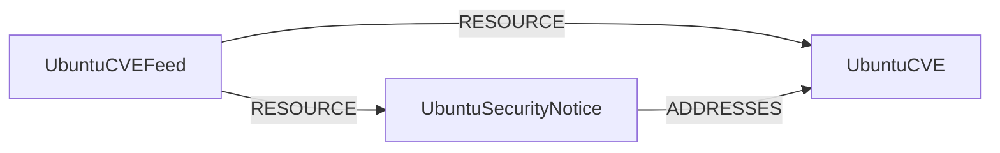

<!-- Generated from the data model. Do not edit manually. -->

## Ubuntu Schema

### UbuntuCVE

A CVE as tracked by the [Ubuntu Security API](https://ubuntu.com/security/cves).

> **Ontology Mapping**: This node uses the ontology label [`CVE`](#ontology-cve).

#### Properties

Ontology-generated fields are shown in *italics*.

| Field | Index | Description |
|-------|-------|-------------|
| id | Yes | CVE identifier prefixed with `USV\|`, for example `USV\|CVE-2024-1234`. |
| firstseen |  | Timestamp when a sync job first created this node. |
| lastupdated | Yes | Timestamp of the last sync that observed this node. |
| attack_complexity |  | CVSS v3 attack complexity. |
| attack_vector |  | CVSS v3 attack vector. |
| availability_impact |  | CVSS v3 availability impact. |
| base_score |  | CVSS v3 base score from the CVE's baseMetricV3 impact data. |
| base_severity |  | CVSS v3 base severity. |
| codename |  | Ubuntu release codename. |
| confidentiality_impact |  | CVSS v3 confidentiality impact. |
| cve_id | Yes | CVE identifier without the Ubuntu prefix, for example `CVE-2024-1234`. |
| cvss3 |  | CVSS v3 score as published by Ubuntu on the CVE. |
| description |  | CVE description. |
| integrity_impact |  | CVSS v3 integrity impact. |
| mitigation |  | Mitigation information, when Ubuntu provides any. |
| priority | Yes | Ubuntu priority rating: critical, high, medium, low or negligible. |
| published |  | Date the CVE was published. |
| status |  | Status of the CVE in Ubuntu's tracker, for example active. |
| ubuntu_description |  | Ubuntu-specific description of the vulnerability. |
| updated_at |  | Date the CVE was last updated. |
| *_ont_attack_complexity* | Yes | Normalized field sourced from `attack_complexity`. |
| *_ont_attack_vector* | Yes | Normalized field sourced from `attack_vector`. |
| *_ont_availability_impact* | Yes | Normalized field sourced from `availability_impact`. |
| *_ont_base_score* | Yes | Normalized field sourced from `base_score`. |
| *_ont_base_severity* | Yes | Normalized field sourced from `base_severity`. |
| *_ont_confidentiality_impact* | Yes | Normalized field sourced from `confidentiality_impact`. |
| *_ont_cve_id* | Yes | Normalized field sourced from `cve_id`. |
| *_ont_description* |  | Normalized field sourced from `description`. |
| *_ont_integrity_impact* | Yes | Normalized field sourced from `integrity_impact`. |
| *_ont_last_modified_date* | Yes | Normalized field sourced from `updated_at`. |
| *_ont_published_date* | Yes | Normalized field sourced from `published`. |
| *_ont_source* |  | Module that populated this node's ontology fields. |
| *_ont_vuln_status* | Yes | Normalized field sourced from `status`. |

#### Relationships

- `(:UbuntuSecurityNotice)-[:ADDRESSES]->(:UbuntuCVE)`: Links a security notice to each CVE it remediates.

- `(:UbuntuCVEFeed)-[:RESOURCE]->(:UbuntuCVE)`: Links the Ubuntu Security feed to a CVE it publishes.

### UbuntuCVEFeed

The Ubuntu Security CVE data feed that owns every notice and CVE it publishes.

#### Properties

| Field | Index | Description |
|-------|-------|-------------|
| id | Yes | Feed identifier. |
| firstseen |  | Timestamp when a sync job first created this node. |
| lastupdated | Yes | Timestamp of the last sync that observed this node. |
| name |  | Name of the feed. |
| url |  | URL of the Ubuntu Security API. |

#### Relationships

- `(:UbuntuCVEFeed)-[:RESOURCE]->(:UbuntuCVE)`: Links the Ubuntu Security feed to a CVE it publishes.

- `(:UbuntuCVEFeed)-[:RESOURCE]->(:UbuntuSecurityNotice)`: Links the Ubuntu Security feed to a notice it publishes.

### UbuntuSecurityNotice

A Ubuntu Security Notice (USN) from the
[Ubuntu Security API](https://ubuntu.com/security/notices).

#### Properties

| Field | Index | Description |
|-------|-------|-------------|
| id | Yes | USN identifier, for example `USN-6600-1`. |
| firstseen |  | Timestamp when a sync job first created this node. |
| lastupdated | Yes | Timestamp of the last sync that observed this node. |
| description |  | Full description of the notice. |
| instructions |  | Remediation instructions. |
| is_hidden |  | Whether Ubuntu marks this notice as hidden. |
| notice_type |  | Type of notice, for example USN. |
| published |  | Date the notice was published. |
| summary |  | Brief summary of the notice. |
| title |  | Title of the security notice. |

#### Relationships

- `(:UbuntuSecurityNotice)-[:ADDRESSES]->(:UbuntuCVE)`: Links a security notice to each CVE it remediates.

- `(:UbuntuCVEFeed)-[:RESOURCE]->(:UbuntuSecurityNotice)`: Links the Ubuntu Security feed to a notice it publishes.
