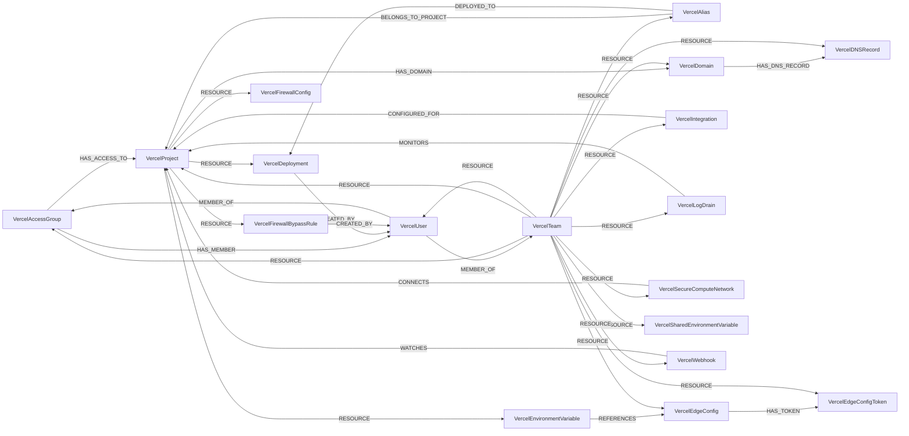

<!-- Generated from the data model. Do not edit manually. -->

## Vercel Schema

### VercelAccessGroup

A Vercel team access group with the canonical Group label.

> **Ontology Mapping**: This node uses the ontology label [`UserGroup`](#ontology-usergroup).

#### Properties

Ontology-generated fields are shown in *italics*.

| Field | Index | Description |
|-------|-------|-------------|
| id | Yes | Access group ID. |
| firstseen |  | Timestamp when a sync job first created this node. |
| lastupdated | Yes | Timestamp of the last sync that observed this node. |
| created_at |  | Timestamp when the access group was created. |
| is_dsync_managed |  | Whether directory sync manages the access group. |
| member_ids |  | IDs of users in the access group. |
| members_count |  | Number of members in the access group. |
| name | Yes | Access group name. |
| projects_count |  | Number of projects assigned to the access group. |
| updated_at |  | Timestamp when the access group was last updated. |
| *_ont_name* | Yes | Normalized field sourced from `name`. |
| *_ont_source* |  | Module that populated this node's ontology fields. |

#### Relationships

- `(:VercelAccessGroup)-[:HAS_ACCESS_TO]->(:VercelProject)`: The Vercel access group grants role-based access to this project.
  - Properties:

    | Field | Description |
    |-------|-------------|
    | role | Value sourced from `role`. |

- `(:VercelAccessGroup)-[:HAS_MEMBER]->(:VercelUser)`: The Vercel access group contains this user as a member. DEPRECATED: this reverse edge is replaced by the canonical `MEMBER_OF` edge and will be removed in v1.0.0.

- `(:VercelUser)-[:MEMBER_OF]->(:VercelAccessGroup)`: A Vercel user is a member of this access group.

- `(:VercelTeam)-[:RESOURCE]->(:VercelAccessGroup)`: The Vercel team contains this access group as a resource.

### VercelAlias

A Vercel hostname alias that points to a deployment.

#### Properties

| Field | Index | Description |
|-------|-------|-------------|
| id | Yes | Alias ID. |
| firstseen |  | Timestamp when a sync job first created this node. |
| lastupdated | Yes | Timestamp of the last sync that observed this node. |
| alias | Yes | Alias hostname. |
| created_at |  | Timestamp when the alias was created. |
| deployment_id |  | ID of the deployment targeted by the alias. |
| project_id |  | ID of the project that owns the alias. |

#### Relationships

- `(:VercelAlias)-[:BELONGS_TO_PROJECT]->(:VercelProject)`: The Vercel alias belongs to this project.

- `(:VercelAlias)-[:DEPLOYED_TO]->(:VercelDeployment)`: The Vercel alias points to this deployment.

- `(:VercelTeam)-[:RESOURCE]->(:VercelAlias)`: The Vercel team contains this alias as a resource.

### VercelDeployment

An individual Vercel deployment of a project.

#### Properties

| Field | Index | Description |
|-------|-------|-------------|
| id | Yes | Deployment ID. |
| firstseen |  | Timestamp when a sync job first created this node. |
| lastupdated | Yes | Timestamp of the last sync that observed this node. |
| created_at |  | Timestamp when the deployment was created. |
| creator_uid |  | ID of the user who created the deployment. |
| exposed_internet | Yes | `True` when the deployment is `READY` with a URL and no project protection method covers it. Which methods cover it depends on whether it is a production or a preview deployment. |
| exposed_internet_type | Yes | How it is exposed. Always `direct`, since the deployment answers on its own URL. |
| meta_git_branch |  | Git branch deployed. |
| meta_git_commit_sha |  | Git commit SHA deployed. |
| name |  | Deployment name. |
| ready_at |  | Timestamp when the deployment became ready. |
| source |  | Source that initiated the deployment. |
| state |  | Deployment state. |
| target |  | Target environment for the deployment. |
| url | Yes | Public deployment URL. |

#### Relationships

- `(:VercelDeployment)-[:CREATED_BY]->(:VercelUser)`: The Vercel deployment was created by this user.

- `(:VercelAlias)-[:DEPLOYED_TO]->(:VercelDeployment)`: The Vercel alias points to this deployment.

- `(:VercelProject)-[:RESOURCE]->(:VercelDeployment)`: The Vercel project contains this deployment as a resource.

### VercelDNSRecord

A Vercel DNS record with the canonical DNSRecord label.

> **Ontology Mapping**: This node uses the ontology label [`DNSRecord`](#ontology-dnsrecord).

#### Properties

Ontology-generated fields are shown in *italics*.

| Field | Index | Description |
|-------|-------|-------------|
| id | Yes | DNS record ID. |
| firstseen |  | Timestamp when a sync job first created this node. |
| lastupdated | Yes | Timestamp of the last sync that observed this node. |
| created_at |  | Timestamp when the DNS record was created. |
| name | Yes | DNS record name. |
| priority |  | DNS record priority when applicable. |
| ttl |  | DNS record time to live. |
| type |  | DNS record type. |
| value |  | DNS record value. |
| *_ont_name* | Yes | Normalized field sourced from `name`. |
| *_ont_source* |  | Module that populated this node's ontology fields. |
| *_ont_type* | Yes | Normalized field sourced from `type`. |
| *_ont_value* | Yes | Normalized field sourced from `value`. |

#### Relationships

- `(:VercelDomain)-[:HAS_DNS_RECORD]->(:VercelDNSRecord)`: The Vercel domain contains this DNS record.

- `(:VercelTeam)-[:RESOURCE]->(:VercelDNSRecord)`: The Vercel team contains this DNS record as a resource.

### VercelDomain

This node label is loaded by more than one sync path:

- A domain configured in Vercel.
- The same domain, as referenced by a project that serves it.

#### Properties

| Field | Index | Description |
|-------|-------|-------------|
| id | Yes | Domain name used as the domain ID. |
| firstseen |  | Timestamp when a sync job first created this node. |
| lastupdated | Yes | Timestamp of the last sync that observed this node. |
| bought_at |  | Timestamp when the domain was purchased. |
| cdn_enabled |  | Whether the CDN is enabled for the domain. |
| created_at |  | Timestamp when the domain was created. |
| expires_at |  | Timestamp when the domain registration expires. |
| name | Yes | Domain name. |
| service_type |  | Service type managing the domain. |
| verified |  | Whether the domain is verified. |

#### Relationships

- `(:VercelDomain)-[:HAS_DNS_RECORD]->(:VercelDNSRecord)`: The Vercel domain contains this DNS record.

- `(:VercelProject)-[:HAS_DOMAIN]->(:VercelDomain)`: The Vercel project uses this domain with project-specific configuration.
  - Properties:

    | Field | Description |
    |-------|-------------|
    | created_at | Value sourced from `createdAt`. |
    | git_branch | Value sourced from `gitBranch`. |
    | project_domain_id | Value sourced from `project_domain_id`. |
    | redirect | Value sourced from `redirect`. |
    | redirect_status_code | Value sourced from `redirectStatusCode`. |
    | updated_at | Value sourced from `updatedAt`. |
    | verified | Value sourced from `verified`. |

- `(:VercelTeam)-[:RESOURCE]->(:VercelDomain)`: The Vercel team contains this domain as a resource.

### VercelEdgeConfig

A Vercel Edge Config that serves runtime data from the edge.

#### Properties

| Field | Index | Description |
|-------|-------|-------------|
| id | Yes | Edge Config ID. |
| firstseen |  | Timestamp when a sync job first created this node. |
| lastupdated | Yes | Timestamp of the last sync that observed this node. |
| created_at |  | Timestamp when the Edge Config was created. |
| digest |  | Content digest of the Edge Config. |
| item_count |  | Number of items in the Edge Config. |
| size_in_bytes |  | Size of the Edge Config in bytes. |
| slug | Yes | Edge Config slug. |
| updated_at |  | Timestamp when the Edge Config was last updated. |

#### Relationships

- `(:VercelEdgeConfig)-[:HAS_TOKEN]->(:VercelEdgeConfigToken)`: The Vercel Edge Config exposes this access token.

- `(:VercelEnvironmentVariable)-[:REFERENCES]->(:VercelEdgeConfig)`: The Vercel environment variable references this Edge Config.

- `(:VercelTeam)-[:RESOURCE]->(:VercelEdgeConfig)`: The Vercel team contains this Edge Config as a resource.

### VercelEdgeConfigToken

A Vercel read token that grants access to an Edge Config.

#### Properties

| Field | Index | Description |
|-------|-------|-------------|
| id | Yes | Edge Config token ID. |
| firstseen |  | Timestamp when a sync job first created this node. |
| lastupdated | Yes | Timestamp of the last sync that observed this node. |
| created_at |  | Timestamp when the Edge Config token was created. |
| label | Yes | Edge Config token label. |

#### Relationships

- `(:VercelEdgeConfig)-[:HAS_TOKEN]->(:VercelEdgeConfigToken)`: The Vercel Edge Config exposes this access token.

- `(:VercelTeam)-[:RESOURCE]->(:VercelEdgeConfigToken)`: The Vercel team contains this Edge Config token as a resource.

### VercelEnvironmentVariable

A project-scoped Vercel environment variable whose value is not stored.

#### Properties

| Field | Index | Description |
|-------|-------|-------------|
| id | Yes | Environment variable ID. |
| firstseen |  | Timestamp when a sync job first created this node. |
| lastupdated | Yes | Timestamp of the last sync that observed this node. |
| comment |  | Optional description of the variable. |
| created_at |  | Timestamp when the variable was created. |
| edge_config_id |  | ID of the referenced Edge Config, if any. |
| git_branch |  | Git branch scope for the variable. |
| key | Yes | Environment variable name. |
| target |  | Target environments for the variable. |
| type |  | Environment variable type. |
| updated_at |  | Timestamp when the variable was last updated. |

#### Relationships

- `(:VercelEnvironmentVariable)-[:REFERENCES]->(:VercelEdgeConfig)`: The Vercel environment variable references this Edge Config.

- `(:VercelProject)-[:RESOURCE]->(:VercelEnvironmentVariable)`: The Vercel project contains this environment variable as a resource.

### VercelFirewallBypassRule

A Vercel firewall bypass rule that weakens firewall protections.

#### Properties

| Field | Index | Description |
|-------|-------|-------------|
| id | Yes | Firewall bypass rule ID. |
| firstseen |  | Timestamp when a sync job first created this node. |
| lastupdated | Yes | Timestamp of the last sync that observed this node. |
| action |  | Action performed by the bypass rule. |
| actor_id |  | ID of the user who created the bypass rule. |
| created_at |  | Timestamp when the bypass rule was created. |
| domain |  | Domain to which the bypass rule applies. |
| ip |  | IP address allowed by the bypass rule. |
| is_project_rule |  | Whether the bypass rule is scoped to a project. |
| note |  | Operator-provided note for the bypass rule. |
| project_id_api |  | Project ID returned by the Vercel API. |

#### Relationships

- `(:VercelFirewallBypassRule)-[:CREATED_BY]->(:VercelUser)`: The Vercel firewall bypass rule was created by this user.

- `(:VercelProject)-[:RESOURCE]->(:VercelFirewallBypassRule)`: The Vercel project contains this firewall bypass rule as a resource.

### VercelFirewallConfig

The Vercel firewall configuration for a project.

#### Properties

| Field | Index | Description |
|-------|-------|-------------|
| id | Yes | Firewall configuration ID. |
| firstseen |  | Timestamp when a sync job first created this node. |
| lastupdated | Yes | Timestamp of the last sync that observed this node. |
| enabled |  | Whether the firewall is enabled. |
| updated_at |  | Timestamp when the firewall configuration was last updated. |

#### Relationships

- `(:VercelProject)-[:RESOURCE]->(:VercelFirewallConfig)`: The Vercel project contains this firewall configuration as a resource.

### VercelIntegration

A third-party integration installed for a Vercel team.

#### Properties

| Field | Index | Description |
|-------|-------|-------------|
| id | Yes | Integration installation ID. |
| firstseen |  | Timestamp when a sync job first created this node. |
| lastupdated | Yes | Timestamp of the last sync that observed this node. |
| created_at |  | Timestamp when the integration was installed. |
| integration_id |  | Integration marketplace ID. |
| project_ids |  | IDs of projects selected for the integration. |
| project_selection |  | Project selection mode for the integration. |
| scopes |  | Scopes granted to the integration. |
| slug | Yes | Integration slug. |
| source |  | Source used to install the integration. |
| status |  | Integration installation status. |
| updated_at |  | Timestamp when the integration was last updated. |

#### Relationships

- `(:VercelIntegration)-[:CONFIGURED_FOR]->(:VercelProject)`: The Vercel integration is configured for this project.

- `(:VercelTeam)-[:RESOURCE]->(:VercelIntegration)`: The Vercel team contains this integration as a resource.

### VercelLogDrain

A Vercel log delivery drain.

#### Properties

| Field | Index | Description |
|-------|-------|-------------|
| id | Yes | Log drain ID. |
| firstseen |  | Timestamp when a sync job first created this node. |
| lastupdated | Yes | Timestamp of the last sync that observed this node. |
| created_at |  | Timestamp when the log drain was created. |
| delivery_format |  | Format used to deliver logs. |
| environments |  | Environments monitored by the drain. |
| name | Yes | Log drain name. |
| project_ids |  | IDs of projects monitored by the drain. |
| sources |  | Log sources delivered by the drain. |
| status |  | Log drain status. |
| url |  | Log drain destination URL. |

#### Relationships

- `(:VercelLogDrain)-[:MONITORS]->(:VercelProject)`: The Vercel log drain monitors this project.

- `(:VercelTeam)-[:RESOURCE]->(:VercelLogDrain)`: The Vercel team contains this log drain as a resource.

### VercelProject

A project managed by Vercel.

#### Properties

| Field | Index | Description |
|-------|-------|-------------|
| id | Yes | Project ID. |
| firstseen |  | Timestamp when a sync job first created this node. |
| lastupdated | Yes | Timestamp of the last sync that observed this node. |
| auto_expose_system_envs |  | Whether system environment variables are exposed automatically. |
| build_command |  | Build command override. |
| created_at |  | Timestamp when the project was created. |
| dev_command |  | Development command override. |
| framework |  | Framework preset used by the project. |
| git_fork_protection |  | Whether fork protection is enabled for Git deployments. |
| install_command |  | Install command override. |
| name | Yes | Project name. |
| node_version |  | Node.js version used by the project. |
| output_directory |  | Build output directory. |
| password_protection_deployment_type |  | Which deployments password protection covers: `all`, `preview`, `prod_deployment_urls_and_all_previews`, or null when it is off. The password itself is never ingested. |
| public_source |  | Whether the project source is publicly viewable. |
| root_directory |  | Root directory of the project. |
| serverless_function_region |  | Region where serverless functions run. |
| skew_protection_max_age |  | Maximum deployment age retained for skew protection. |
| sso_protection_deployment_type |  | Which deployments Vercel Authentication covers: `all`, `preview`, `prod_deployment_urls_and_all_previews`, or null when it is off. |
| updated_at |  | Timestamp when the project was last updated. |

#### Relationships

- `(:VercelAlias)-[:BELONGS_TO_PROJECT]->(:VercelProject)`: The Vercel alias belongs to this project.

- `(:VercelIntegration)-[:CONFIGURED_FOR]->(:VercelProject)`: The Vercel integration is configured for this project.

- `(:VercelSecureComputeNetwork)-[:CONNECTS]->(:VercelProject)`: The Vercel secure compute network connects to this project by environment.
  - Properties:

    | Field | Description |
    |-------|-------------|
    | environments | Value sourced from `environments`. |
    | passive_environments | Value sourced from `passive_environments`. |

- `(:VercelAccessGroup)-[:HAS_ACCESS_TO]->(:VercelProject)`: The Vercel access group grants role-based access to this project.
  - Properties:

    | Field | Description |
    |-------|-------------|
    | role | Value sourced from `role`. |

- `(:VercelProject)-[:HAS_DOMAIN]->(:VercelDomain)`: The Vercel project uses this domain with project-specific configuration.
  - Properties:

    | Field | Description |
    |-------|-------------|
    | created_at | Value sourced from `createdAt`. |
    | git_branch | Value sourced from `gitBranch`. |
    | project_domain_id | Value sourced from `project_domain_id`. |
    | redirect | Value sourced from `redirect`. |
    | redirect_status_code | Value sourced from `redirectStatusCode`. |
    | updated_at | Value sourced from `updatedAt`. |
    | verified | Value sourced from `verified`. |

- `(:VercelLogDrain)-[:MONITORS]->(:VercelProject)`: The Vercel log drain monitors this project.

- `(:VercelProject)-[:RESOURCE]->(:VercelDeployment)`: The Vercel project contains this deployment as a resource.

- `(:VercelProject)-[:RESOURCE]->(:VercelEnvironmentVariable)`: The Vercel project contains this environment variable as a resource.

- `(:VercelProject)-[:RESOURCE]->(:VercelFirewallBypassRule)`: The Vercel project contains this firewall bypass rule as a resource.

- `(:VercelProject)-[:RESOURCE]->(:VercelFirewallConfig)`: The Vercel project contains this firewall configuration as a resource.

- `(:VercelTeam)-[:RESOURCE]->(:VercelProject)`: The Vercel team contains this project as a resource.

- `(:VercelWebhook)-[:WATCHES]->(:VercelProject)`: The Vercel webhook watches this project.

### VercelSecureComputeNetwork

A Vercel secure compute network for private connectivity.

#### Properties

| Field | Index | Description |
|-------|-------|-------------|
| id | Yes | Secure compute network ID. |
| firstseen |  | Timestamp when a sync job first created this node. |
| lastupdated | Yes | Timestamp of the last sync that observed this node. |
| created_at |  | Timestamp when the network was created. |
| name | Yes | Secure compute network name. |
| region |  | Cloud region containing the network. |
| status |  | Secure compute network status. |

#### Relationships

- `(:VercelSecureComputeNetwork)-[:CONNECTS]->(:VercelProject)`: The Vercel secure compute network connects to this project by environment.
  - Properties:

    | Field | Description |
    |-------|-------------|
    | environments | Value sourced from `environments`. |
    | passive_environments | Value sourced from `passive_environments`. |

- `(:VercelTeam)-[:RESOURCE]->(:VercelSecureComputeNetwork)`: The Vercel team contains this secure compute network as a resource.

### VercelSharedEnvironmentVariable

A team-scoped Vercel environment variable whose value is not stored.

#### Properties

| Field | Index | Description |
|-------|-------|-------------|
| id | Yes | Shared environment variable ID. |
| firstseen |  | Timestamp when a sync job first created this node. |
| lastupdated | Yes | Timestamp of the last sync that observed this node. |
| created_at |  | Timestamp when the shared variable was created. |
| key | Yes | Shared environment variable name. |
| target |  | Target environments for the shared variable. |
| type |  | Shared environment variable type. |
| updated_at |  | Timestamp when the shared variable was last updated. |

#### Relationships

- `(:VercelTeam)-[:RESOURCE]->(:VercelSharedEnvironmentVariable)`: The Vercel team contains this shared environment variable as a resource.

### VercelTeam

A Vercel team with the canonical Tenant label.

> **Ontology Mapping**: This node uses the ontology label [`Tenant`](#ontology-tenant).

#### Properties

Ontology-generated fields are shown in *italics*.

| Field | Index | Description |
|-------|-------|-------------|
| id | Yes | Team ID. |
| firstseen |  | Timestamp when a sync job first created this node. |
| lastupdated | Yes | Timestamp of the last sync that observed this node. |
| avatar |  | URL of the team avatar. |
| created_at |  | Timestamp when the team was created. |
| name |  | Team display name. |
| slug | Yes | URL slug of the team. |
| *_ont_name* | Yes | Normalized field sourced from `name`. |
| *_ont_source* |  | Module that populated this node's ontology fields. |

#### Relationships

- `(:VercelUser)-[:MEMBER_OF]->(:VercelTeam)`: The Vercel user belongs to this team with membership details.
  - Properties:

    | Field | Description |
    |-------|-------------|
    | confirmed | Value sourced from `confirmed`. |
    | joined_from | Value sourced from `joinedFrom`. |
    | role | Value sourced from `role`. |

- `(:VercelTeam)-[:RESOURCE]->(:VercelAccessGroup)`: The Vercel team contains this access group as a resource.

- `(:VercelTeam)-[:RESOURCE]->(:VercelAlias)`: The Vercel team contains this alias as a resource.

- `(:VercelTeam)-[:RESOURCE]->(:VercelDNSRecord)`: The Vercel team contains this DNS record as a resource.

- `(:VercelTeam)-[:RESOURCE]->(:VercelDomain)`: The Vercel team contains this domain as a resource.

- `(:VercelTeam)-[:RESOURCE]->(:VercelEdgeConfig)`: The Vercel team contains this Edge Config as a resource.

- `(:VercelTeam)-[:RESOURCE]->(:VercelEdgeConfigToken)`: The Vercel team contains this Edge Config token as a resource.

- `(:VercelTeam)-[:RESOURCE]->(:VercelIntegration)`: The Vercel team contains this integration as a resource.

- `(:VercelTeam)-[:RESOURCE]->(:VercelLogDrain)`: The Vercel team contains this log drain as a resource.

- `(:VercelTeam)-[:RESOURCE]->(:VercelProject)`: The Vercel team contains this project as a resource.

- `(:VercelTeam)-[:RESOURCE]->(:VercelSecureComputeNetwork)`: The Vercel team contains this secure compute network as a resource.

- `(:VercelTeam)-[:RESOURCE]->(:VercelSharedEnvironmentVariable)`: The Vercel team contains this shared environment variable as a resource.

- `(:VercelTeam)-[:RESOURCE]->(:VercelUser)`: The Vercel team contains this user as a resource.

- `(:VercelTeam)-[:RESOURCE]->(:VercelWebhook)`: The Vercel team contains this webhook as a resource.

### VercelUser

A Vercel team member with the canonical UserAccount label.

> **Ontology Mapping**: This node uses the ontology label [`UserAccount`](#ontology-useraccount).

#### Properties

Ontology-generated fields are shown in *italics*.

| Field | Index | Description |
|-------|-------|-------------|
| id | Yes | User ID. |
| firstseen |  | Timestamp when a sync job first created this node. |
| lastupdated | Yes | Timestamp of the last sync that observed this node. |
| confirmed |  | Whether the team membership is confirmed. |
| created_at |  | Timestamp when the user account was created. |
| email | Yes | User email address. |
| joined_from |  | Method by which the user joined the team. |
| name |  | User display name. |
| role |  | User role in the team. |
| username | Yes | Vercel username. |
| *_ont_active* | Yes | Normalized field sourced from `confirmed`. |
| *_ont_email* | Yes | Normalized field sourced from `email`. |
| *_ont_fullname* | Yes | Normalized field sourced from `name`. |
| *_ont_source* |  | Module that populated this node's ontology fields. |
| *_ont_username* | Yes | Normalized field sourced from `username`. |

#### Relationships

- `(:VercelDeployment)-[:CREATED_BY]->(:VercelUser)`: The Vercel deployment was created by this user.

- `(:VercelFirewallBypassRule)-[:CREATED_BY]->(:VercelUser)`: The Vercel firewall bypass rule was created by this user.

- `(:User)-[:HAS_ACCOUNT]->(:VercelUser)`

- `(:VercelAccessGroup)-[:HAS_MEMBER]->(:VercelUser)`: The Vercel access group contains this user as a member. DEPRECATED: this reverse edge is replaced by the canonical `MEMBER_OF` edge and will be removed in v1.0.0.

- `(:VercelUser)-[:MEMBER_OF]->(:VercelAccessGroup)`: A Vercel user is a member of this access group.

- `(:VercelUser)-[:MEMBER_OF]->(:VercelTeam)`: The Vercel user belongs to this team with membership details.
  - Properties:

    | Field | Description |
    |-------|-------------|
    | confirmed | Value sourced from `confirmed`. |
    | joined_from | Value sourced from `joinedFrom`. |
    | role | Value sourced from `role`. |

- `(:VercelTeam)-[:RESOURCE]->(:VercelUser)`: The Vercel team contains this user as a resource.

### VercelWebhook

A webhook endpoint configured for a Vercel team.

#### Properties

| Field | Index | Description |
|-------|-------|-------------|
| id | Yes | Webhook ID. |
| firstseen |  | Timestamp when a sync job first created this node. |
| lastupdated | Yes | Timestamp of the last sync that observed this node. |
| created_at |  | Timestamp when the webhook was created. |
| events |  | Event types subscribed to by the webhook. |
| project_ids |  | IDs of projects watched by the webhook. |
| updated_at |  | Timestamp when the webhook was last updated. |
| url | Yes | Webhook destination URL. |

#### Relationships

- `(:VercelTeam)-[:RESOURCE]->(:VercelWebhook)`: The Vercel team contains this webhook as a resource.

- `(:VercelWebhook)-[:WATCHES]->(:VercelProject)`: The Vercel webhook watches this project.
