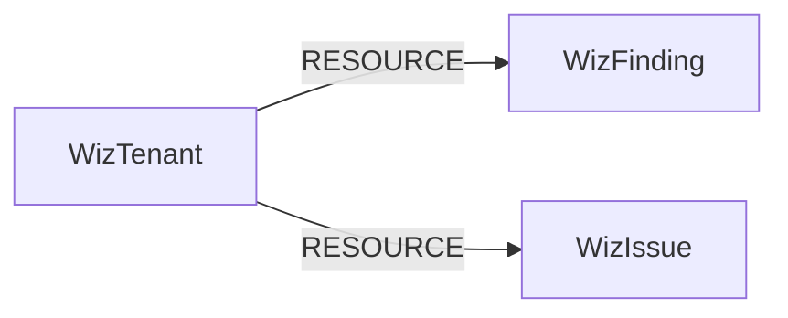

<!-- Generated from the data model. Do not edit manually. -->

## Wiz Schema

### WizFinding

> **Conditional Labels**:
>
> - [`CVE`](#ontology-cve) (ontology label) when `has_cve` equals `true`. A cross-provider CVE resource in Cartography's ontology.
> - [`SecurityIssue`](#ontology-securityissue) (ontology label) when `is_security_issue` equals `true`. A cross-provider SecurityIssue resource in Cartography's ontology.

#### Properties

Ontology-generated fields are shown in *italics*.

| Field | Index | Description |
|-------|-------|-------------|
| id | Yes | Wiz finding ID. |
| firstseen |  | Timestamp when a sync job first created this node. |
| lastupdated | Yes | Timestamp when this Wiz finding was last seen. |
| actor_ids |  | Wiz actor IDs associated with the finding. |
| actor_names |  | Wiz actor names associated with the finding. |
| cloud_account_ids |  | Wiz cloud account IDs associated with the finding. |
| cloud_account_names |  | Wiz cloud account names associated with the finding. |
| cloud_organization_ids |  | Wiz cloud organization IDs associated with the finding. |
| cloud_organization_names |  | Wiz cloud organization names associated with the finding. |
| created_at |  | Timestamp when Wiz created the finding. |
| cve_description |  | CVE description associated with the finding. |
| cve_id | Yes | CVE ID associated with the finding. |
| cvss_severity | Yes | CVSS severity associated with the finding. |
| description |  | Wiz finding description. |
| detailed_name |  | Detailed vulnerability or finding name from Wiz. |
| detection_method |  | Wiz detection method for the finding. |
| exploitability_score |  | CVSS exploitability score for the finding. |
| finding_type | Yes | Wiz finding family. |
| first_detected_at |  | Timestamp when Wiz first detected the finding. |
| first_seen_at |  | Timestamp when Wiz first saw the finding. |
| fixed_version |  | Fixed package or component version. |
| has_cisa_kev_exploit |  | Whether Wiz reports the CVE in the CISA KEV catalog. |
| has_cve |  | Whether the finding has a CVE identifier. |
| has_exploit |  | Whether Wiz reports a known exploit. |
| impact_score |  | CVSS impact score for the finding. |
| is_security_issue |  | Whether the finding is a non-CVE security issue. |
| last_detected_at |  | Timestamp when Wiz last detected the finding. |
| link |  | External reference URL for the finding. |
| location_path |  | Affected file or runtime path for the finding. |
| name | Yes | Wiz finding name. |
| origins |  | Wiz origins associated with the finding. |
| portal_url |  | Wiz portal URL for the finding. |
| project_ids | Yes | Wiz project IDs associated with the finding. |
| project_names |  | Wiz project names associated with the finding. |
| remediation |  | Wiz remediation guidance for the finding. |
| resolution_reason |  | Reason Wiz marked the finding resolved. |
| resolved_at |  | Timestamp when Wiz resolved the finding. |
| resource_cloud_platform |  | Cloud platform of the affected resource. |
| resource_external_id | Yes | Provider-native ID of the affected resource. |
| resource_id | Yes | Wiz ID of the affected resource. |
| resource_name |  | Name of the affected Wiz resource. |
| resource_native_type |  | Cloud-native type of the affected resource. |
| resource_region |  | Cloud region of the affected resource. |
| resource_status |  | Wiz status of the affected resource. |
| resource_type | Yes | Wiz type of the affected resource. |
| result | Yes | Wiz finding result. |
| rule_as_control |  | Whether Wiz treats the rule as a control. |
| rule_builtin |  | Whether the Wiz rule is built in. |
| rule_description |  | Wiz rule description associated with the finding. |
| rule_graph_id | Yes | Wiz graph rule ID associated with the finding. |
| rule_id | Yes | Wiz rule ID associated with the finding. |
| rule_name |  | Wiz rule name associated with the finding. |
| score |  | CVSS score associated with the finding. |
| severity | Yes | Wiz finding severity. |
| status | Yes | Wiz finding status. |
| subscription_external_id | Yes | Provider-native subscription ID for the affected resource. |
| subscription_id | Yes | Wiz subscription ID for the affected resource. |
| subscription_name |  | Subscription name for the affected resource. |
| target_external_id |  | External ID of the Wiz finding target. |
| target_object_provider_unique_id | Yes | Provider-unique ID of the Wiz finding target. |
| triggering_event_ids |  | Wiz triggering event IDs for the finding. |
| updated_at |  | Timestamp when Wiz last updated the finding. |
| vendor_severity | Yes | Vendor-reported severity for the finding. |
| version |  | Affected package or component version. |
| *_ont_base_score* | Yes | Normalized field sourced from `score`. |
| *_ont_base_severity* | Yes | Normalized field sourced from `cvss_severity`. |
| *_ont_cve_id* | Yes | Normalized field sourced from `cve_id`. |
| *_ont_description* |  | Normalized field sourced from `cve_description`. |
| *_ont_exploitability_score* | Yes | Normalized field sourced from `exploitability_score`. |
| *_ont_first_seen* | Yes | Normalized field sourced from `first_seen_at`. |
| *_ont_impact_score* | Yes | Normalized field sourced from `impact_score`. |
| *_ont_severity* | Yes | Normalized field sourced from `severity`. |
| *_ont_source* |  | Module that populated this node's ontology fields. |
| *_ont_status* | Yes | Normalized field sourced from `status`. |
| *_ont_title* | Yes | Normalized field sourced from `name`. |
| *_ont_type* | Yes | Normalized field sourced from `finding_type`. |

#### Relationships

- `(:WizFinding)-[:LINKED_TO]->(:CVE)`

- `(:WizTenant)-[:RESOURCE]->(:WizFinding)`

### WizIssue

> **Ontology Mapping**: This node uses the ontology label [`SecurityIssue`](#ontology-securityissue).

#### Properties

Ontology-generated fields are shown in *italics*.

| Field | Index | Description |
|-------|-------|-------------|
| id | Yes | Wiz issue ID. |
| firstseen |  | Timestamp when a sync job first created this node. |
| lastupdated | Yes | Timestamp when this Wiz issue was last seen. |
| control_description |  | Wiz control description associated with the issue. |
| control_id | Yes | Wiz control ID associated with the issue. |
| control_name |  | Wiz control name associated with the issue. |
| created_at |  | Timestamp when Wiz created the issue. |
| due_at |  | Wiz issue due timestamp. |
| issue_type | Yes | Wiz issue type. |
| name | Yes | Wiz issue name. |
| project_ids | Yes | Wiz project IDs associated with the issue. |
| project_names |  | Wiz project names associated with the issue. |
| resolution_recommendation |  | Wiz remediation guidance for the issue. |
| resolved_at |  | Timestamp when Wiz resolved the issue. |
| resource_cloud_platform |  | Cloud platform of the affected resource. |
| resource_external_id | Yes | Provider-native ID of the affected resource. |
| resource_id | Yes | Wiz ID of the affected resource. |
| resource_name |  | Name of the affected Wiz resource. |
| resource_native_type |  | Cloud-native type of the affected resource. |
| resource_type | Yes | Wiz type of the affected resource. |
| service_ticket_urls |  | Service ticket URLs associated with the issue. |
| severity | Yes | Wiz issue severity. |
| source_rule_id | Yes | Wiz source rule ID for the issue. |
| source_rule_name |  | Wiz source rule name for the issue. |
| status | Yes | Wiz issue status. |
| status_changed_at |  | Timestamp when the Wiz issue status last changed. |
| updated_at |  | Timestamp when Wiz last updated the issue. |
| *_ont_first_seen* | Yes | Normalized field sourced from `created_at`. |
| *_ont_severity* | Yes | Normalized field sourced from `severity`. |
| *_ont_source* |  | Module that populated this node's ontology fields. |
| *_ont_status* | Yes | Normalized field sourced from `status`. |
| *_ont_title* | Yes | Normalized field sourced from `name`. |
| *_ont_type* | Yes | Normalized field sourced from `issue_type`. |

#### Relationships

- `(:WizTenant)-[:RESOURCE]->(:WizIssue)`

### WizTenant

> **Ontology Mapping**: This node uses the ontology label [`Tenant`](#ontology-tenant).

#### Properties

| Field | Index | Description |
|-------|-------|-------------|
| id | Yes | Stable Wiz tenant identifier. |
| firstseen |  | Timestamp when a sync job first created this node. |
| lastupdated | Yes | Timestamp when this Wiz tenant was last seen. |
| graphql_url |  | Wiz GraphQL API endpoint used for this tenant. |

#### Relationships

- `(:WizTenant)-[:RESOURCE]->(:WizFinding)`

- `(:WizTenant)-[:RESOURCE]->(:WizIssue)`
