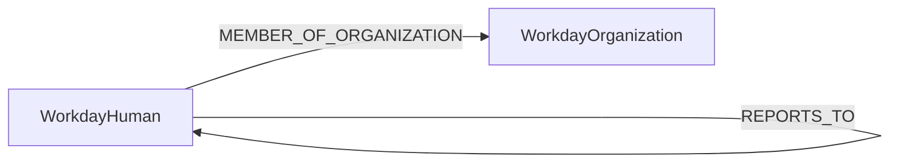

<!-- Generated from the data model. Do not edit manually. -->

## Workday Schema

### WorkdayHuman

A person in Workday with the Human label for identity integration.

> **Additional Labels**: This node also uses `Human`.

> **Additional Label Definitions**:
>
> - `Human`: A workday node participating in the shared Human graph interface.

#### Properties

| Field | Index | Description |
|-------|-------|-------------|
| id | Yes | Employee ID. |
| firstseen |  | Timestamp when a sync job first created this node. |
| lastupdated | Yes | Timestamp of the last sync that observed this node. |
| company |  | Company or legal entity name. |
| cost_center |  | Cost center code. |
| country |  | Country from the work address. |
| email | Yes | Work email address indexed for cross-module relationships. |
| employee_id | Yes | Employee ID indexed for lookups. |
| function |  | Functional area. |
| location |  | Office or work location. |
| name |  | Full name. |
| source |  | Data source, always "WORKDAY". |
| sub_function |  | Sub-functional area. |
| sub_team |  | Sub-team name. |
| team |  | Team name. |
| title |  | Job or business title. |
| worker_type |  | Type of worker, such as employee or contractor. |

#### Relationships

- `(:WorkdayHuman)-[:MEMBER_OF_ORGANIZATION]->(:WorkdayOrganization)`: A Workday person is a member of a supervisory organization.

- `(:WorkdayHuman)-[:REPORTS_TO]->(:WorkdayHuman)`: A Workday person reports to another Workday person.

### WorkdayOrganization

A supervisory organization or department in Workday.

#### Properties

| Field | Index | Description |
|-------|-------|-------------|
| id | Yes | Organization name. |
| firstseen |  | Timestamp when a sync job first created this node. |
| lastupdated | Yes | Timestamp of the last sync that observed this node. |
| name |  | Organization name. |

#### Relationships

- `(:WorkdayHuman)-[:MEMBER_OF_ORGANIZATION]->(:WorkdayOrganization)`: A Workday person is a member of a supervisory organization.
