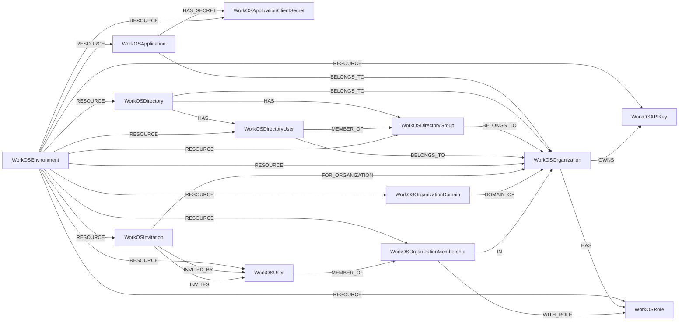

<!-- Generated from the data model. Do not edit manually. -->

## Workos Schema

### WorkOSAPIKey

A WorkOS API key with the canonical APIKey label.

> **Ontology Mapping**: This node uses the ontology label [`APIKey`](#ontology-apikey).

#### Properties

Ontology-generated fields are shown in *italics*.

| Field | Index | Description |
|-------|-------|-------------|
| id | Yes | WorkOS API key ID. |
| firstseen |  | Timestamp when a sync job first created this node. |
| lastupdated | Yes | Timestamp of the last sync that observed this node. |
| created_at |  | RFC 3339 timestamp when the API key was created. |
| last_used_at |  | RFC 3339 timestamp when the API key was last used. |
| name |  | API key name. |
| obfuscated_value |  | Obfuscated API key value. |
| permissions |  | Permissions granted to the API key. |
| updated_at |  | RFC 3339 timestamp when the API key was updated. |
| *_ont_created_at* | Yes | Normalized field sourced from `created_at`. |
| *_ont_last_used_at* | Yes | Normalized field sourced from `last_used_at`. |
| *_ont_name* | Yes | Normalized field sourced from `name`. |
| *_ont_source* |  | Module that populated this node's ontology fields. |
| *_ont_updated_at* | Yes | Normalized field sourced from `updated_at`. |

#### Relationships

- `(:User)-[:OWNS]->(:WorkOSAPIKey)`: generated by analysis job `Ontology - User OWNS APIKey linking`.

- `(:WorkOSOrganization)-[:OWNS]->(:WorkOSAPIKey)`: The WorkOS organization owns this API key.

- `(:WorkOSEnvironment)-[:RESOURCE]->(:WorkOSAPIKey)`: The WorkOS environment contains this API key as a resource.

### WorkOSApplication

A WorkOS Connect application with the canonical ThirdPartyApp label.

> **Ontology Mapping**: This node uses the ontology label [`ThirdPartyApp`](#ontology-thirdpartyapp).

#### Properties

| Field | Index | Description |
|-------|-------|-------------|
| id | Yes | WorkOS application ID. |
| firstseen |  | Timestamp when a sync job first created this node. |
| lastupdated | Yes | Timestamp of the last sync that observed this node. |
| application_type |  | Application type, such as m2m. |
| client_id | Yes | OAuth client ID. |
| created_at |  | RFC 3339 timestamp when the application was created. |
| description |  | Application description. |
| name |  | Application name. |
| scopes |  | OAuth scopes granted to the application. |
| updated_at |  | RFC 3339 timestamp when the application was updated. |

#### Relationships

- `(:User)-[:AUTHORIZED]->(:WorkOSApplication)`: generated by analysis job `Ontology - User AUTHORIZED ThirdPartyApp linking`.
  - Properties:

    | Field | Description |
    |-------|-------------|
    | scopes | Property generated by analysis job: `Ontology - User AUTHORIZED ThirdPartyApp linking`. |

- `(:WorkOSApplication)-[:BELONGS_TO]->(:WorkOSOrganization)`: The WorkOS application belongs to its organization when one is assigned.

- `(:WorkOSApplication)-[:HAS_SECRET]->(:WorkOSApplicationClientSecret)`: The WorkOS application has this client secret.

- `(:WorkOSEnvironment)-[:RESOURCE]->(:WorkOSApplication)`: The WorkOS environment contains this application as a resource.

### WorkOSApplicationClientSecret

A WorkOS application client secret with the canonical APIKey label.

> **Ontology Mapping**: This node uses the ontology label [`APIKey`](#ontology-apikey).

#### Properties

| Field | Index | Description |
|-------|-------|-------------|
| id | Yes | WorkOS application client secret ID. |
| firstseen |  | Timestamp when a sync job first created this node. |
| lastupdated | Yes | Timestamp of the last sync that observed this node. |
| created_at |  | RFC 3339 timestamp when the secret was created. |
| last_used_at |  | RFC 3339 timestamp when the secret was last used. |
| secret_hint |  | Last characters of the client secret value. |
| updated_at |  | RFC 3339 timestamp when the secret was updated. |

#### Relationships

- `(:WorkOSApplication)-[:HAS_SECRET]->(:WorkOSApplicationClientSecret)`: The WorkOS application has this client secret.

- `(:User)-[:OWNS]->(:WorkOSApplicationClientSecret)`: generated by analysis job `Ontology - User OWNS APIKey linking`.

- `(:WorkOSEnvironment)-[:RESOURCE]->(:WorkOSApplicationClientSecret)`: The WorkOS environment contains this client secret as a resource.

### WorkOSDirectory

A directory sync connection in WorkOS.

#### Properties

| Field | Index | Description |
|-------|-------|-------------|
| id | Yes | WorkOS directory ID. |
| firstseen |  | Timestamp when a sync job first created this node. |
| lastupdated | Yes | Timestamp of the last sync that observed this node. |
| created_at |  | RFC 3339 timestamp when the directory was created. |
| domain |  | Domain associated with the directory. |
| name |  | Directory name. |
| state |  | Directory connection state. |
| type |  | Directory identity provider type. |
| updated_at |  | RFC 3339 timestamp when the directory was updated. |

#### Relationships

- `(:WorkOSDirectory)-[:BELONGS_TO]->(:WorkOSOrganization)`: The WorkOS directory belongs to its organization.

- `(:WorkOSDirectory)-[:HAS]->(:WorkOSDirectoryGroup)`: The WorkOS directory contains this directory group.

- `(:WorkOSDirectory)-[:HAS]->(:WorkOSDirectoryUser)`: The WorkOS directory contains this directory user.

- `(:WorkOSEnvironment)-[:RESOURCE]->(:WorkOSDirectory)`: The WorkOS environment contains this directory as a resource.

### WorkOSDirectoryGroup

A group synchronized from an external identity provider through WorkOS.

#### Properties

| Field | Index | Description |
|-------|-------|-------------|
| id | Yes | WorkOS directory group ID. |
| firstseen |  | Timestamp when a sync job first created this node. |
| lastupdated | Yes | Timestamp of the last sync that observed this node. |
| created_at |  | RFC 3339 timestamp when the directory group was created. |
| idp_id | Yes | Group ID assigned by the identity provider. |
| name |  | Directory group name. |
| raw_attributes |  | Raw group attributes from the identity provider. |
| updated_at |  | RFC 3339 timestamp when the directory group was updated. |

#### Relationships

- `(:WorkOSDirectoryGroup)-[:BELONGS_TO]->(:WorkOSOrganization)`: The WorkOS directory group belongs to its organization.

- `(:WorkOSDirectory)-[:HAS]->(:WorkOSDirectoryGroup)`: The WorkOS directory contains this directory group.

- `(:WorkOSDirectoryUser)-[:MEMBER_OF]->(:WorkOSDirectoryGroup)`: The WorkOS directory user is a member of each assigned directory group.

- `(:WorkOSEnvironment)-[:RESOURCE]->(:WorkOSDirectoryGroup)`: The WorkOS environment contains this directory group as a resource.

### WorkOSDirectoryUser

A directory-synchronized WorkOS user with the canonical UserAccount label.

> **Ontology Mapping**: This node uses the ontology label [`UserAccount`](#ontology-useraccount).

#### Properties

Ontology-generated fields are shown in *italics*.

| Field | Index | Description |
|-------|-------|-------------|
| id | Yes | WorkOS directory user ID. |
| firstseen |  | Timestamp when a sync job first created this node. |
| lastupdated | Yes | Timestamp of the last sync that observed this node. |
| created_at |  | RFC 3339 timestamp when the directory user was created. |
| custom_attributes |  | Custom user attributes from the identity provider. |
| directory_id | Yes | ID of the user's WorkOS directory. |
| email | Yes | User email address. |
| first_name |  | User first name. |
| idp_id | Yes | User ID assigned by the identity provider. |
| last_name |  | User last name. |
| organization_id | Yes | ID of the user's WorkOS organization. |
| raw_attributes |  | Raw user attributes from the identity provider. |
| roles |  | Directory role slugs assigned by the identity provider. |
| state |  | Directory user state. |
| updated_at |  | RFC 3339 timestamp when the directory user was updated. |
| *_ont_active* | Yes | Normalized field sourced from `state`. |
| *_ont_email* | Yes | Normalized field sourced from `email`. |
| *_ont_firstname* | Yes | Normalized field sourced from `first_name`. |
| *_ont_lastname* | Yes | Normalized field sourced from `last_name`. |
| *_ont_source* |  | Module that populated this node's ontology fields. |

#### Relationships

- `(:WorkOSDirectoryUser)-[:BELONGS_TO]->(:WorkOSOrganization)`: The WorkOS directory user belongs to its organization.

- `(:WorkOSDirectory)-[:HAS]->(:WorkOSDirectoryUser)`: The WorkOS directory contains this directory user.

- `(:User)-[:HAS_ACCOUNT]->(:WorkOSDirectoryUser)`

- `(:WorkOSDirectoryUser)-[:MEMBER_OF]->(:WorkOSDirectoryGroup)`: The WorkOS directory user is a member of each assigned directory group.

- `(:WorkOSEnvironment)-[:RESOURCE]->(:WorkOSDirectoryUser)`: The WorkOS environment contains this directory user as a resource.

### WorkOSEnvironment

A WorkOS environment with the canonical Environment label.

> **Additional Labels**: This node also uses `Environment`.

> **Additional Label Definitions**:
>
> - `Environment`: A workos node participating in the shared Environment graph interface.

#### Properties

| Field | Index | Description |
|-------|-------|-------------|
| id | Yes | WorkOS client ID identifying the environment. |
| firstseen |  | Timestamp when a sync job first created this node. |
| lastupdated | Yes | Timestamp of the last sync that observed this node. |

#### Relationships

- `(:WorkOSEnvironment)-[:RESOURCE]->(:WorkOSAPIKey)`: The WorkOS environment contains this API key as a resource.

- `(:WorkOSEnvironment)-[:RESOURCE]->(:WorkOSApplication)`: The WorkOS environment contains this application as a resource.

- `(:WorkOSEnvironment)-[:RESOURCE]->(:WorkOSApplicationClientSecret)`: The WorkOS environment contains this client secret as a resource.

- `(:WorkOSEnvironment)-[:RESOURCE]->(:WorkOSDirectory)`: The WorkOS environment contains this directory as a resource.

- `(:WorkOSEnvironment)-[:RESOURCE]->(:WorkOSDirectoryGroup)`: The WorkOS environment contains this directory group as a resource.

- `(:WorkOSEnvironment)-[:RESOURCE]->(:WorkOSDirectoryUser)`: The WorkOS environment contains this directory user as a resource.

- `(:WorkOSEnvironment)-[:RESOURCE]->(:WorkOSInvitation)`: The WorkOS environment contains this invitation as a resource.

- `(:WorkOSEnvironment)-[:RESOURCE]->(:WorkOSOrganization)`: The WorkOS environment contains this organization as a resource.

- `(:WorkOSEnvironment)-[:RESOURCE]->(:WorkOSOrganizationDomain)`: The WorkOS environment contains this organization domain as a resource.

- `(:WorkOSEnvironment)-[:RESOURCE]->(:WorkOSOrganizationMembership)`: The WorkOS environment contains this organization membership as a resource.

- `(:WorkOSEnvironment)-[:RESOURCE]->(:WorkOSRole)`: The WorkOS environment contains this role as a resource.

- `(:WorkOSEnvironment)-[:RESOURCE]->(:WorkOSUser)`: The WorkOS environment contains this user as a resource.

### WorkOSInvitation

An invitation to join a WorkOS organization.

#### Properties

| Field | Index | Description |
|-------|-------|-------------|
| id | Yes | WorkOS invitation ID. |
| firstseen |  | Timestamp when a sync job first created this node. |
| lastupdated | Yes | Timestamp of the last sync that observed this node. |
| accepted_at |  | RFC 3339 timestamp when the invitation was accepted. |
| created_at |  | RFC 3339 timestamp when the invitation was created. |
| email | Yes | Email address of the invited user. |
| expires_at |  | RFC 3339 timestamp when the invitation expires. |
| inviter_user_id |  | ID of the user who created the invitation. |
| organization_id | Yes | ID of the organization receiving the invitee. |
| revoked_at |  | RFC 3339 timestamp when the invitation was revoked. |
| state |  | Invitation state. |
| updated_at |  | RFC 3339 timestamp when the invitation was updated. |

#### Relationships

- `(:WorkOSInvitation)-[:FOR_ORGANIZATION]->(:WorkOSOrganization)`: The WorkOS invitation is for its organization.

- `(:WorkOSInvitation)-[:INVITED_BY]->(:WorkOSUser)`: The WorkOS invitation was created by its inviter user.

- `(:WorkOSInvitation)-[:INVITES]->(:WorkOSUser)`: The WorkOS invitation invites the user with the matching email address.

- `(:WorkOSEnvironment)-[:RESOURCE]->(:WorkOSInvitation)`: The WorkOS environment contains this invitation as a resource.

### WorkOSOrganization

A WorkOS organization with the canonical Tenant label.

> **Ontology Mapping**: This node uses the ontology label [`Tenant`](#ontology-tenant).

#### Properties

Ontology-generated fields are shown in *italics*.

| Field | Index | Description |
|-------|-------|-------------|
| id | Yes | WorkOS organization ID. |
| firstseen |  | Timestamp when a sync job first created this node. |
| lastupdated | Yes | Timestamp of the last sync that observed this node. |
| allow_profiles_outside_organization |  | Whether profiles outside the organization are allowed. |
| created_at |  | RFC 3339 timestamp when the organization was created. |
| name |  | Organization name. |
| updated_at |  | RFC 3339 timestamp when the organization was updated. |
| *_ont_name* | Yes | Normalized field sourced from `name`. |
| *_ont_source* |  | Module that populated this node's ontology fields. |

#### Relationships

- `(:WorkOSApplication)-[:BELONGS_TO]->(:WorkOSOrganization)`: The WorkOS application belongs to its organization when one is assigned.

- `(:WorkOSDirectory)-[:BELONGS_TO]->(:WorkOSOrganization)`: The WorkOS directory belongs to its organization.

- `(:WorkOSDirectoryGroup)-[:BELONGS_TO]->(:WorkOSOrganization)`: The WorkOS directory group belongs to its organization.

- `(:WorkOSDirectoryUser)-[:BELONGS_TO]->(:WorkOSOrganization)`: The WorkOS directory user belongs to its organization.

- `(:WorkOSOrganizationDomain)-[:DOMAIN_OF]->(:WorkOSOrganization)`: The WorkOS organization domain belongs to its organization.

- `(:WorkOSInvitation)-[:FOR_ORGANIZATION]->(:WorkOSOrganization)`: The WorkOS invitation is for its organization.

- `(:WorkOSOrganization)-[:HAS]->(:WorkOSRole)`: The WorkOS organization has this role.

- `(:WorkOSOrganizationMembership)-[:IN]->(:WorkOSOrganization)`: The WorkOS organization membership is in its organization.

- `(:WorkOSOrganization)-[:OWNS]->(:WorkOSAPIKey)`: The WorkOS organization owns this API key.

- `(:WorkOSEnvironment)-[:RESOURCE]->(:WorkOSOrganization)`: The WorkOS environment contains this organization as a resource.

### WorkOSOrganizationDomain

A domain associated with a WorkOS organization.

#### Properties

| Field | Index | Description |
|-------|-------|-------------|
| id | Yes | WorkOS organization domain ID. |
| firstseen |  | Timestamp when a sync job first created this node. |
| lastupdated | Yes | Timestamp of the last sync that observed this node. |
| domain |  | Organization domain name. |
| organization_id |  | ID of the organization that owns the domain. |
| state |  | Domain verification state. |
| verification_strategy |  | Strategy used to verify the domain. |
| verification_token |  | Token used to verify the domain. |

#### Relationships

- `(:WorkOSOrganizationDomain)-[:DOMAIN_OF]->(:WorkOSOrganization)`: The WorkOS organization domain belongs to its organization.

- `(:WorkOSEnvironment)-[:RESOURCE]->(:WorkOSOrganizationDomain)`: The WorkOS environment contains this organization domain as a resource.

### WorkOSOrganizationMembership

A WorkOS user's membership in an organization.

#### Properties

| Field | Index | Description |
|-------|-------|-------------|
| id | Yes | WorkOS organization membership ID. |
| firstseen |  | Timestamp when a sync job first created this node. |
| lastupdated | Yes | Timestamp of the last sync that observed this node. |
| created_at |  | RFC 3339 timestamp when the membership was created. |
| organization_id | Yes | ID of the organization containing the membership. |
| status |  | Organization membership status. |
| updated_at |  | RFC 3339 timestamp when the membership was updated. |
| user_id | Yes | ID of the member user. |

#### Relationships

- `(:WorkOSOrganizationMembership)-[:IN]->(:WorkOSOrganization)`: The WorkOS organization membership is in its organization.

- `(:WorkOSUser)-[:MEMBER_OF]->(:WorkOSOrganizationMembership)`: The WorkOS user is a member through this organization membership.

- `(:WorkOSEnvironment)-[:RESOURCE]->(:WorkOSOrganizationMembership)`: The WorkOS environment contains this organization membership as a resource.

- `(:WorkOSOrganizationMembership)-[:WITH_ROLE]->(:WorkOSRole)`: The WorkOS organization membership has each role identified by its role slug list.

### WorkOSRole

A WorkOS role with the canonical PermissionRole label.

> **Ontology Mapping**: This node uses the ontology label [`PermissionRole`](#ontology-permissionrole).

#### Properties

Ontology-generated fields are shown in *italics*.

| Field | Index | Description |
|-------|-------|-------------|
| id | Yes | WorkOS role ID. |
| firstseen |  | Timestamp when a sync job first created this node. |
| lastupdated | Yes | Timestamp of the last sync that observed this node. |
| created_at |  | RFC 3339 timestamp when the role was created. |
| description |  | Role description. |
| name |  | Role name. |
| organization_id |  | ID of the organization that owns the role. |
| slug | Yes | Unique role slug. |
| type |  | Role scope type, such as environment or organization. |
| updated_at |  | RFC 3339 timestamp when the role was updated. |
| *_ont_name* | Yes | Normalized field sourced from `name`. |
| *_ont_scope* | Yes | Normalized field sourced from `type`. |
| *_ont_source* |  | Module that populated this node's ontology fields. |
| *_ont_type* | Yes | Normalized field sourced from `type`. |

#### Relationships

- `(:WorkOSOrganization)-[:HAS]->(:WorkOSRole)`: The WorkOS organization has this role.

- `(:WorkOSEnvironment)-[:RESOURCE]->(:WorkOSRole)`: The WorkOS environment contains this role as a resource.

- `(:WorkOSOrganizationMembership)-[:WITH_ROLE]->(:WorkOSRole)`: The WorkOS organization membership has each role identified by its role slug list.

### WorkOSUser

A WorkOS user with the canonical UserAccount label.

> **Ontology Mapping**: This node uses the ontology label [`UserAccount`](#ontology-useraccount).

#### Properties

Ontology-generated fields are shown in *italics*.

| Field | Index | Description |
|-------|-------|-------------|
| id | Yes | WorkOS user ID. |
| firstseen |  | Timestamp when a sync job first created this node. |
| lastupdated | Yes | Timestamp of the last sync that observed this node. |
| created_at |  | RFC 3339 timestamp when the user was created. |
| email | Yes | User email address. |
| email_verified |  | Whether the user's email address is verified. |
| first_name |  | User first name. |
| last_name |  | User last name. |
| last_sign_in_at |  | RFC 3339 timestamp of the user's last sign-in. |
| profile_picture_url |  | URL of the user's profile picture. |
| updated_at |  | RFC 3339 timestamp when the user was updated. |
| *_ont_email* | Yes | Normalized field sourced from `email`. |
| *_ont_firstname* | Yes | Normalized field sourced from `first_name`. |
| *_ont_lastactivity* | Yes | Normalized field sourced from `last_sign_in_at`. |
| *_ont_lastname* | Yes | Normalized field sourced from `last_name`. |
| *_ont_source* |  | Module that populated this node's ontology fields. |

#### Relationships

- `(:User)-[:HAS_ACCOUNT]->(:WorkOSUser)`

- `(:WorkOSInvitation)-[:INVITED_BY]->(:WorkOSUser)`: The WorkOS invitation was created by its inviter user.

- `(:WorkOSInvitation)-[:INVITES]->(:WorkOSUser)`: The WorkOS invitation invites the user with the matching email address.

- `(:WorkOSUser)-[:MEMBER_OF]->(:WorkOSOrganizationMembership)`: The WorkOS user is a member through this organization membership.

- `(:WorkOSEnvironment)-[:RESOURCE]->(:WorkOSUser)`: The WorkOS environment contains this user as a resource.
